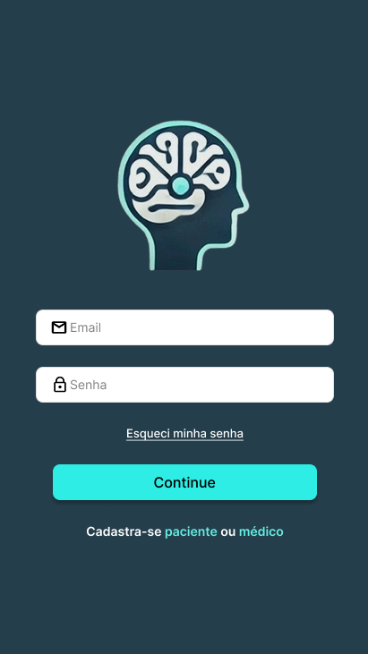
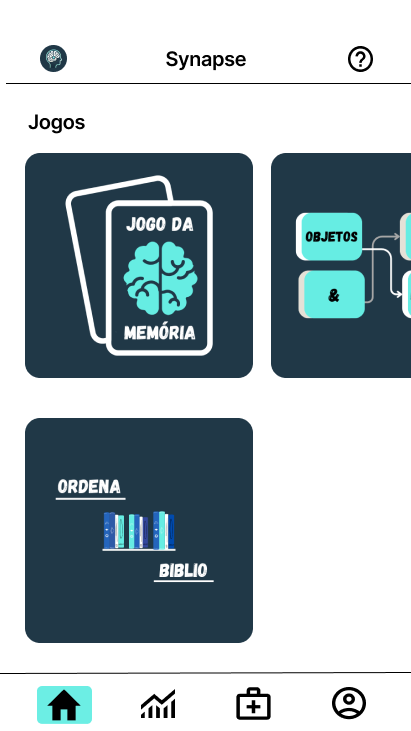
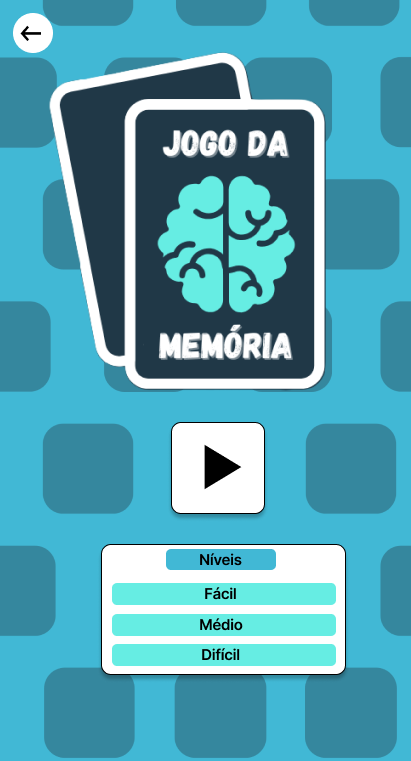
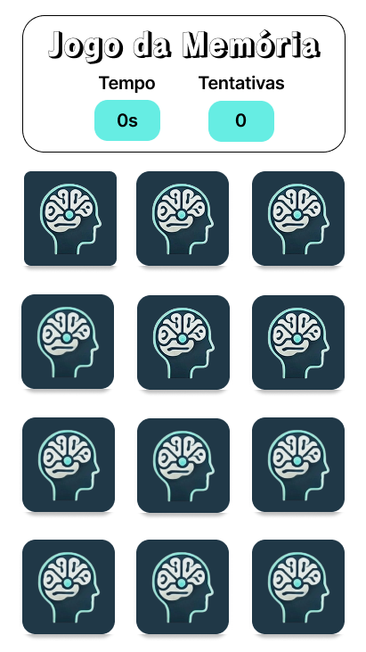
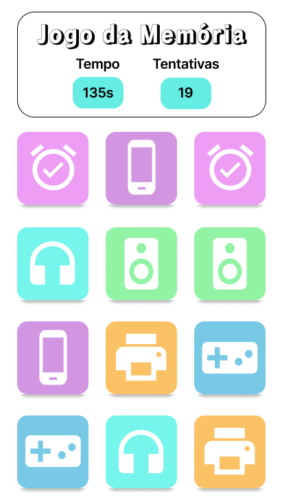

# Design do Projeto Synapse

## Sobre o projeto

O **Synapse** é um aplicativo voltado para a **reabilitação e suporte de pessoas com sequelas leves do Acidente Vascular Cerebral (AVC)**, oferecendo atividades direcionadas para a **reabilitação cognitiva e motora**.

---

## Identidade Visual

### Paleta de cores

As cores do aplicativo foram escolhidas para transmitir **calma, confiança, segurança e acessibilidade**, proporcionando uma experiência agradável para pessoas com sequelas leves do AVC.

* **Azul-esverdeado:** transmite tranquilidade, estabilidade e confiança.
* **Ciano/Turquesa:** utilizado para destacar botões e informações importantes, facilitando a navegação.
* **Branco:** mantém a interface limpa e organizada, além de melhorar a leitura.

### Logo

A logo é formada por um **perfil humano junto ao cérebro e suas conexões neurais**, representando a **atividade cerebral, a reabilitação cognitiva e a recuperação do paciente após o AVC**.

Dessa forma, a identidade visual busca unir **tecnologia, saúde e cuidado**, atendendo tanto aos pacientes quanto aos profissionais de saúde.

---

## Telas do aplicativo

### Tela inicial

<!-- Adicione aqui a imagem da tela inicial -->

  

---

### Tela de login

<!-- Adicione aqui a imagem da tela de login -->

  

---

### Menu principal

<!-- Adicione aqui a imagem do menu principal -->

  

---

### Atividades de reabilitação

<!-- Adicione aqui as imagens das atividades -->

  
  
  

---

##Protótipo no Figma

O design e o protótipo das telas do aplicativo foram desenvolvidos no **Figma**.

🔗 **[Acessar o projeto no Figma](https://www.figma.com/design/2tP1bE6t2tEzyzY9utLFK8/Synapse?node-id=480-6&t=k6c6hPTxijS6bJiQ-1)**

---

## Ferramenta utilizada

* **Figma** — criação da identidade visual, prototipação e desenvolvimento das interfaces do aplicativo.

